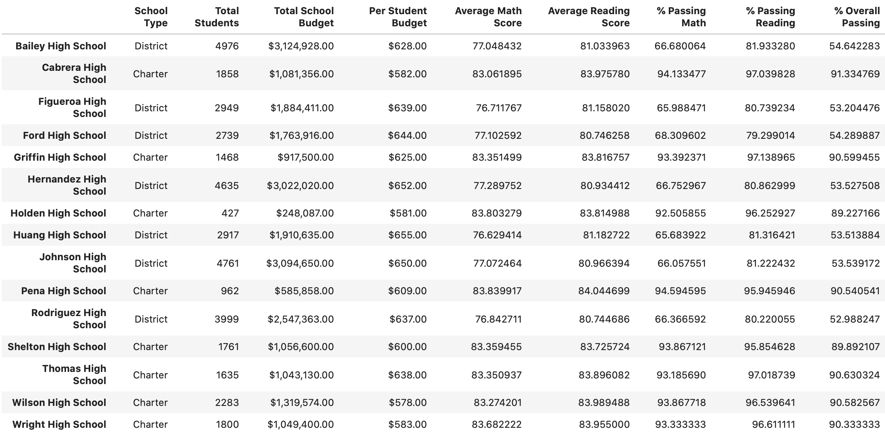

# School District Analysis 

## Overview
The scope of this analysis is to assist the school district in analyzing and reporting school performance after discovering evidence of academic dishonesty concerning the reported reading and math scores of the ninth-grade class at Thomas High School. As the latitude of the modification of these scores in still unknown, we have omitted the ninth-grade class results from Thomas High School from our calculations.

In order to do so, we have replaced the cores for these ninth graders with notation “NaN’, or not a number. This allows us to retain the student data for reporting headcount and spending per student but calculate performance without their scores.

## Results

### How is the district summary affected?
The district summary, which summarizes the overall district budget and performance, appears largely resilient towards an alteration of this magnitude. As we have not eliminated any students or schools entirely from the dataset, our figures reflecting these totals and the total budget will remain the same. The average math score and percentage of students with passing math scores in this district have decreased slightly. Meanwhile, the average reading score and percentage of students with passing reading scores in this district have increased in nearly the same amount.

### How is the school summary affected?

As demonstrated with the district summary, much of our data will not be affected by the removal of math and reading scores for the ninth-grade class at Thomas High School. The scores for students attending other schools within the district will not change. The scores for students attending Thomas High School and in grades ten through twelve will also remain the same. However, because we cannot confidently report scores for the ninth-grade students, the average scores and the percentage of students with passing scores in this math and reading disciplines will change for Thomas High School as a whole.

How does this affect Thomas High School’s performance?
- Math and reading scores:
    - Average math scores of Thomas High School decreased from 83.42 to 83.35
    - Average reading scores of Thomas High School increased from 83.85 to 83.90
    - Percentage of students at Thomas High School with a passing math score decreased from 93.27% to 93.19%
    - Percentage of students at Thomas High School with a passing reading score decreased from 97.31% to 97.02%
    - Overall percentage of students at Thomas High School with passing scores decreased from 90.95% to 90.63%
-	Scores by school spending:
    - Thomas High School falls into the spending bucket of $630-$644 per student. Comparing the new analysis with that done before removing ninth-grade math and reading scores, we can see a slight change in average math and reading scores for schools in this bin. Math scores decreased .02 points from an average 78.52 to 78.50. Reading scores increased .02 points from an average 81.62 to 81.64.
    - The percentage of students with passing scores in these disciplines has similarly been affected by modifying our data. The percentage of students passing math in this spending bin fell from 73.48% to 73.46%. The percentage of students passing reading dropped more drastically from 84.39% to 84.32%.
    - The percentage of students attending schools in this spending bucket and with passing math *and* reading scores also decreased. The percentage of overall passing scores dropped to 62.78% from 62.86%.
-	Scores by school size:
    - With 1635 students, Thomas High School is considered a medium-sized school. Modifying our data to exclude ninth-grade scores from Thomas High School did not bring a statistically significant change to the computation of scores by school size. After rounding to the board’s preference, the summary of scores broken down by school size remains the same.
-	Scores by school type:
    - Thomas High School is a Charter School. Again, modifying our data to exclude ninth-grade scores from Thomas High School did not have a statistically significant influence on the summarization of scores by school type. After rounding to the board’s preference, the summary of scores broken down by school type also remains the same.

## Summary
Our new analysis indicates that removing the scores from the ninth-grade class at Thomas High School impacts the school’s performance in all four measured areas: average math score, average reading score, percentage of students with passing math scores, and percentage of students with passing reading scores. The average math score and the percentage of students with passing math scores at Thomas High has decreased as a result of this modification. While students’ average reading scores have increased, the percentage of students with passing reading scores has gone down. Overall, the percentage of students at Thomas High School with passing scores in *both* reading and math has declined. As depicted in the district summary, these effects are echoed in the district’s performance.
